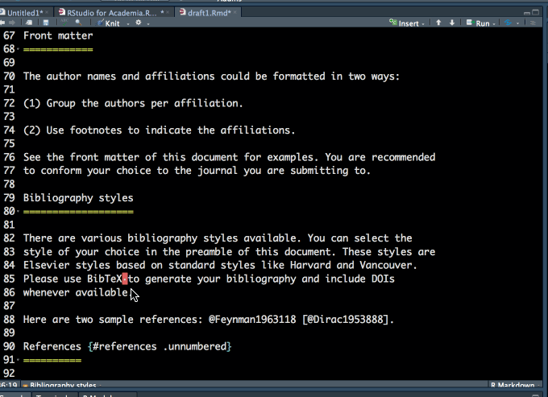

```{r setup, include=FALSE}
knitr::opts_chunk$set(echo = F, message=F, warning=F)
```


```{r }
library(papaja)
library(rticles)
library(rmarkdown)
library(RefManageR)
library(citr)
library(ggplot2)
library(ggsci)
library(stargazer)
library(pixiedust)
library(psycho)

papaja::r_refs(file = "r-references.bib")
```


# はじめに

今年も始まりました。[RStudio Advent Calender](https://qiita.com/advent-calendar/2017/rstudio)。今日で5日目です。みなさま楽しんでおられますでしょうか？    

### 本記事の内容

- 論文のテンプレート (rticles, papaja)
- 引用文献の管理 (RefManageR)
- 図表や数式
- 解析結果の報告ツール (sigr, statcheck, psycho, papaja)
- 便利ツール (wordcount, gramr)


### 楽しんでいただける層
- 英語論文を書くプロセスをRStudioで完結させたい！
- RStudioの画面だけ眺めて仕事がしたい
- rmarkdownで文章作成した経験がちょっとある
- texを使いこなすまでのガッツはない

### RStudioで論文を書く理由
RStudioで論文を書くモチベーションは、端的に述べるならば、再現可能性を高めるためです。再現可能性の高い論文(reproducible research paper)が必要とされる主な理由を3点, [Mike Frank & Chris Hartgerink (2017)](https://libscie.github.io/rmarkdown-workshop/handout.html)は, 以下のように述べています。

1. エラーを回避するため  
[Nujiten et al. (2016)]では, APA (American Psychological Association)形式の論文での,p値を用いた検定結果を報告している文を収集して, 10%以上の論文が, 検定統計量とp値の報告,解釈に不一致があることを示しています。(例えば, その不一致が見られた論文の約半数では,t検定のt値がめちゃくちゃ小さくてサンプルサイズも小さいのに, p値が0.001以下となって有意だったというような,検定統計量とp値のズレが発生していました)。RStudioで論文執筆を進めると,解析ソフトから原稿執筆ソフトに解析結果の情報を転記するプロセスで生じるヒューマンエラーを減少することができます。

2. 計算の再現性    
研究の再現可能性を担保する上で, 他者が解析結果を再現可能であることが重要な要件となります。近年, 解析モデルは複雑化しているので, 論文に掲載されている情報のみでは,解析結果を再現するのが難しいものも少なくありません。解析に用いたデータやコードの公表を求める論文も多くなってきています。RStudioで論文を書くと, 論文とコードの対応が明確ですし, 公表も容易です。

3. 改稿が簡単
論文の修正など、簡単に実行可能です。特に図表の修正となると、他ソフトを使う場合には、他ソフトで修正したものを、再度コピペして論文原稿の方にセッティングしてと、手間が多いですが、そのような手間を省けます。
　
  
ようは、エラー少なく、再現性高く、無駄な労力を削減して、生産性高く論文を書こうということです。


# 論文のテンプレート

RStudioでのドキュメント生成は, rmarkdown[@R-rmarkdown]を使っていきます。rmarkdown[@R-rmarkdown]自体の解説は[ぞうさんの記事](https://kazutan.github.io/kazutanR/Rmd_intro.html)が基本カバーしているのでそちらもご参照ください。

## 論文執筆に役立つRパッケージ
今回は,packageでテンプレートが用意されていているものを紹介します。今日紹介するテンプレートが自分が投稿したい雑誌とフィットしていなければ, 細かい調整が必要になります。今回はrticlesとpapajaパッケージを紹介します。

### rticlesパッケージ[@R-rticles]

- RStudioのチームが提供しているパッケージです。
- テンプレートが豊富です。対応している雑誌は[本家サイト](https://github.com/rstudio/rticles)を参照ください。
    - 本家サイトには掲載されていませんが, 現在のバージョンでは, Plos oneやPNASなども追加されています。
    
### papajaパッケージ[@R-papaja]
- APA (American Psychological Association)形式に特化したパッケージです。
- APA形式の図表作製用の関数も含まれています。
- rmd内で使用したpackageの引用文献リスト自動生成してくれる関数が含まれていて便利です。


この二つで結構な範囲のスタイルがカバーできます。

### パッケージのインストール

というわけで, まずはこの二つのパッケージをインストールしましょう。
papajaはCRANに登録されていないので, githubインストールです。

```{r pkgtemp,echo=T, eval=F}
install.packages("rticles")
devtools::install_github("crsh/papaja") 
```


### 執筆執筆に必要なファイルを準備

試しにrticlesのelsevier形式のテンプレートを開いてみます。
下記のコードを実行するとdraft1(任意のフォルダ名)というフォルダができて、その中に、原稿作製に必要な5つのファイル生成されます。  

- .rmd   
    - このrmdファイルを編集して原稿仕上げて行きます。  
- .cslファイル  
    - このファイルは, 引用文献のスタイルを指定しています。  
- .bibファイル  
    - このファイルは, 引用文献情報を管理しています。  
- .styファイル
    - 原稿のレイアウトやスタイルを指定しています (基本いじりません)
- .pdf
    - rmarkdownをknitrすると出来上がる論文原稿です
- .tex
    - markdownと対応したtexファイルも出力されます。
    
基本的にいじるのはrmdファイルのみで, 必要に応じて.bibファイルを調整します  


```{r rticles, eval=F}
library(rticles)
library(rmarkdown)
rmarkdown::draft("draft1", template = "elsevier_article", package = "rticles")
```


では, .rmdの中身をみてみましょう。
YAMLヘッダーで下記を指定します。

- 著者名
- 所属 
- 連絡先
- アブストラクト

```{r, eval=F, echo=T}

---
title: All we need is bayes. 
author:
  - name: Yoshitake Takebayashi
    email: xxxx@xxx.ac.jp
    affiliation: Bayes-Juku
    footnote: Corresponding Author
  - name: Masaru Tokuoka
    email: zzzz@zzzz.com
    affiliation: Bayes-Juku
address:
  - code: Some Institute of Technology
    address: Department, Street, City, State, Zip
  - code: Another University
    address: Department, Street, City, State, Zip
abstract: |
  This is the abstract.

  It consists of two paragraphs.

bibliography: mybibfile.bib
output: rticles::elsevier_article
---
  
```


# 引用文献の管理 (RefManageR)

YMALヘッダーのbibliographyで引用文献情報のファイルを指定します。ここでは.bibファイルを指定します。.bibファイルは, 文献管理ソフトから作製すること可能です。


## RrefManageRから.bibファイルを生成

おっと, ここでタイトルから逸脱してしまいました。他ソフトに浮気してしまいました。実際的には,ここは文献管理を他のソフトでやってそこから.bibファイルを生成するのが一番良いですが, タイトル通り, 浮気せずにやってみましょう。RrefManageRというパッケージを使います。

### [RefManageR](https://github.com/ropensci/RefManageR)

- 文献情報を検索, リスト生成など, 文献管理のためのパッケージ
- zoteroなど有名どころのオンラインで文献管理されている情報にアクセスして.bibファイルを生成できる
- zoteroで管理している情報を抜き出して.bibを生成する方法はこちらを[参照](https://tclavelle.github.io/blog/reference_tips/)


RefManageRでは, 文献管理ソフトではZoteroから, 論文検索サイトではPubmedから書誌情報をゲットして.bibファイルを生成できます。
Zoteroから生成する場合,ユーザIDとアクセスキーが必要になります。ウェブ上でzoteroのアカウントにログインするとsettingから確認できます。


```{r, eval=F, echo=T}
library(RrefManageR)
# zoteroから書誌情報を読み込む
zotero<-ReadZotero(user = "ユーザID", .params = list(q = "検索用語", 
                                                          key = "アクセスキー"))

# pubmedから情報を読み込む
pubmed<-ReadPubMed("検索用語", database = "PubMed")

# .bibファイルとして出力する
WriteBib(zotero, file="zotero.bib",biblatex=T, verbose=F)                               
WriteBib(pubmed,file = "pubmed.bib", biblatex = T, verbose = F)
```

### 複数の.bibファイルを指定する

先のセクションでは, 二つの.bibファイルを作成しました(pubmed.bibとzotero.bib)。その場合, bibliography: を以下のように指定すればOKです。

```
bibliography:["zotero.bib", "pubmed.bib"]
```


### 使用したRのpackageの引用リスト

papajaパッケージには, r_refs関数が含まれており,論文原稿の作成するrmdファイル内のチャンクで実行したRのパッケージの引用文献情報の.bibファイルを自動生成してくれます。最近は解析に使ったソフトウェアやパッケージの引用も求められることが多いです。そんな時,解析に使用したR packageの引用文献がひとまとめに取得できると便利です。

```{r, eval=F}
papaja::r_refs(file = "r-references.bib")
```

ここで生成されたr-references.bibも, YAMLヘッダーのbibliograpyに追加してやればOKです。


## [citrパッケージ](https://github.com/crsh/citr)

さて,.bibファイルができたら,本文中の引用文献を挿入したい箇所に文献情報を指定して行きます。ここからcitrパッケージが大活躍します。citrパッケージはRStudioのAddinとして機能します。まずは, パッケージをインストールします。

```{r, echo=T, eval=F}
install.packages("citr")
```

パッケージをインストールできたら,本文の引用文献を挿入したい箇所にカーソルをセットします。そしてAddinから「Insert citation」を選択します。すると, YAMLヘッダーのbibliographyで指定した.bibファイルを読み込んで, gifの用にGUIで論文を選択できます。





```{r,echo=T, eval=F}
install.packages("RefManageR","citr")
```


# 図表

綺麗な器が揃ったら、メインディッシュの盛り付けです。論文のメインは、図表、数式ですね。論文形式に対応した図表の作成が必要ですが、そんなときに役立つpackageをいくつか。

### APA系の表作成パッケージ
- papajaに含まれる関数
- apastats(https://github.com/achetverikov/APAstats)

APAスタイルで行きたいときは、papajaに含まれている関数が便利です。papajaの使い方の詳細は,[papajaのbookdown](https://crsh.github.io/papaja_man/introduction.html)が非常に役立ちます。apastatsは一般化線形混合モデルの表まで含めて作成されているようですが, まだ開発途上なようです。


### APA以外の表作成パッケージ
- stargazer(https://www.r-statistics.com/2013/01/stargazer-package-for-beautiful-latex-tables-from-r-statistical-models-output/)
- pixiedust(https://github.com/nutterb/pixiedust)

APA系以外は,stargazerパッケージがいくつかの雑誌のスタイルをカバーしているようですが, 手広くありません。他には, broomパッケージと組み合わせて表が作れるpixiedustパッケージというのもあって, 使いこなせると便利そうですが詳細は追えていません。


### APA系の図の作成パッケージ

- papajaに含まれる関数
- ggsci(https://cran.r-project.org/web/packages/ggsci/vignettes/ggsci.html)

ggsciはJAMAやNEJMやLancetなど高級雑誌のカラーパレットを指定できるパッケージです笑
この辺に当たり前に出せるようになれたらいいですね。。。


### ggsのカラーパターン

```{r, echo=T}
library("ggsci")
library("ggplot2")
library("gridExtra")

data("diamonds")

p1 = ggplot(subset(diamonds, carat >= 2.2),
       aes(x = table, y = price, colour = cut)) +
  geom_point(alpha = 0.7) +
  geom_smooth(method = "loess", alpha = 0.05, size = 1, span = 1) +
  theme_bw()

p2 = ggplot(subset(diamonds, carat > 2.2 & depth > 55 & depth < 70),
       aes(x = depth, fill = cut)) +
  geom_histogram(colour = "black", binwidth = 1, position = "dodge") +
  theme_bw()
```


### Lancet カラー
```{r, echo=T}
p1_lancet = p1 + scale_color_lancet()
p2_lancet = p2 + scale_fill_lancet()
grid.arrange(p1_lancet, p2_lancet, ncol = 2)

p1_jama = p1 + scale_color_jama()
p2_jama = p2 + scale_fill_jama()
grid.arrange(p1_jama, p2_jama, ncol = 2)


```


### JAMA カラー
```{r, echo=T}
p1_jama = p1 + scale_color_jama()
p2_jama = p2 + scale_fill_jama()
grid.arrange(p1_jama, p2_jama, ncol = 2)
```


# 解析結果の報告ツール (sigr, psycho)

解析の統計量を文中に挿入する際に, 転記ミスが生じやすいものです。RStudioで解析した結果からそのまま数値を取ってきて文章に挿入するとそのようなエラーが減ります。

そのような志向のパッケージに, sigr(https://github.com/WinVector/sigr)やpsycho(https://github.com/neuropsychology/psycho.R)パッケージがあります。


例えば, 一般化線形モデルの解析結果の統計量を報告する際には

```{r, results="hide",echo=T}
library(sigr)

d <- data.frame(x=c(1,2,3,4,5,6,7,7),
      y=c(TRUE,FALSE,FALSE,FALSE,TRUE,TRUE,TRUE,FALSE))
model <- glm(y~x,data=d,family=binomial)
summary(model)
```

sigrのwrapChiSqTestを使って

```{r, echo=T, results="asis"}
cat(render(wrapChiSqTest(model),
           pLargeCutoff=1, format='markdown'))
```

と, 統計量を含んだ文を生成してくれます。


# 便利ツール (wordcount, gramr)

その他に, 論文作成のために便利なaddinを紹介します。

- wordcount
    - 文字カウントをしてくれます。

- gramr
    - 文法チェックをしてくれます。


# 最後に

後半, パッケージ名のみの紹介になってしまいましたが, 論文作成周りのパッケージが徐々に充実してきているように思います。私もまだまだつまずくことが多々ありますが, とりあえずテンプレートにそっておおよその形は作っていけるかと思います。解析結果をそのまま埋め込んでいける感じがやっぱ良いです。

Enjoy, Writing Manuscripts with RStudio !!

# reference


